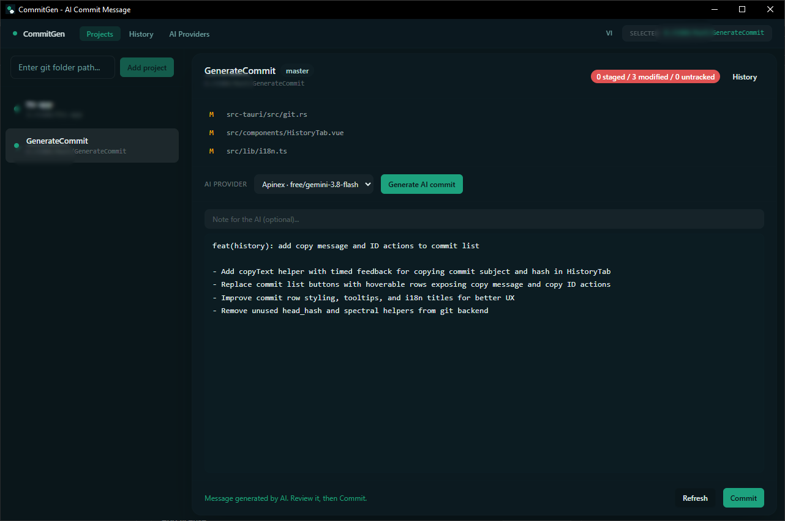
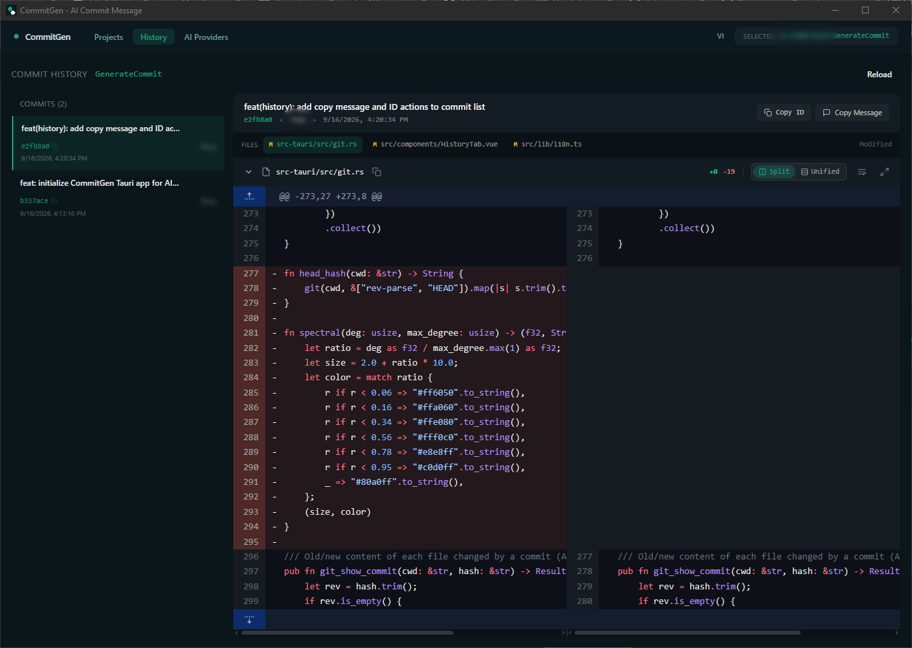

# CommitGen — AI Commit Message Generator (Tauri + Vue 3)

AI-powered commit message generator for multiple Git repositories, inspired by Cline's logic (`commit-message-generator.ts` + `utils/git.ts`), built with a modern UI (Vue 3 + Vite + Tailwind).

<p align="center">
  
  
</p>

## Features

- **Projects** — Add paths to multiple Git repositories and click on any project to manage it:
  click **"Generate Commit with AI"** → AI generates a commit message into a spacious editor, allowing you to review/edit before clicking **Commit**.
- **History & Diff** — Review commit history, inspect side-by-side / unified file diffs, and quickly copy commit hash or message.
- **AI Providers** — Configure multiple providers compatible with the standard **chat completions API** (OpenAI / OpenRouter / DeepSeek / Groq / local Ollama, etc.), including quick-fill presets, customizable base URL, model name, API key, and system prompt.
- **Cline-style diff logic** — Prioritizes staged changes, falls back to unstaged changes, and includes untracked files (via `git diff --no-index /dev/null`).

## Getting Started

```bash
pnpm install        # Install frontend dependencies
pnpm tauri dev      # Run in development mode (GUI)
```

Build release:

```bash
pnpm tauri build    # Generate installer (NSIS/MSI) in src-tauri/target/release/bundle
```

## Project Structure

- `src/` — Vue 3 frontend (`ProjectsTab` / `HistoryTab` / `ProvidersTab`)
- `src-tauri/src/git.rs` — Ported `git.ts`: diff, status, log, commit
- `src-tauri/src/providers.rs` — Chat completions API client + Cline-style prompt
- `src-tauri/src/config.rs` — Stores projects & providers at `%APPDATA%/vn.commitgen.app/config.json`

## Testing & Verification

```bash
cargo test --manifest-path src-tauri/Cargo.toml   # Run Git workflow tests
pnpm typecheck                                    # Vue/TS type checking
```